Getting Started
###############

This document will guide you through getting a pBot instance up and running. It
should take about 10 minutes and only assumes you already have a Discord account.

--------------------------------------------------------------------------------

==============================
Registering a bot with Discord
==============================

The first thing you'll need to do is generate a token for your bot.
Navigate to the `Discord developer portal <https://discord.com/developers/>`_.
*(As of this writing, you will be automatically forwarded to the
Applications page.)*

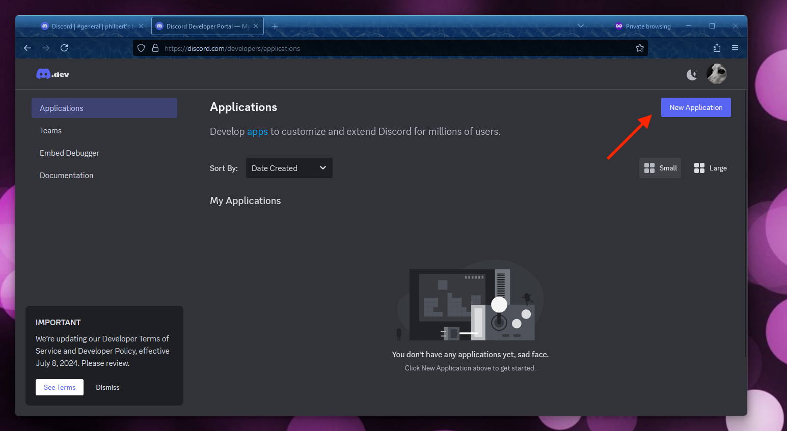

|

Click on the **New Application** button and you'll be prompted to name your
bot. *(This is how the bot will be displayed to your users!)*
For this example, our bot will just provide taco recipes so
we'll name it simply "TacoLover" after the source image I got the avatar from (`Taco Lover <https://www.instagram.com/mcfriendy/p/C6l8TqEpDnf/>`_).

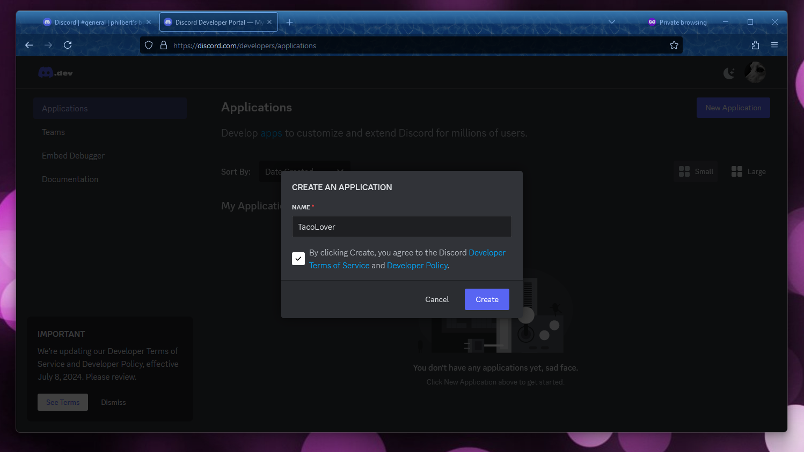

|

Once you've named your application, navigate the **Bot** page under **Settings**.

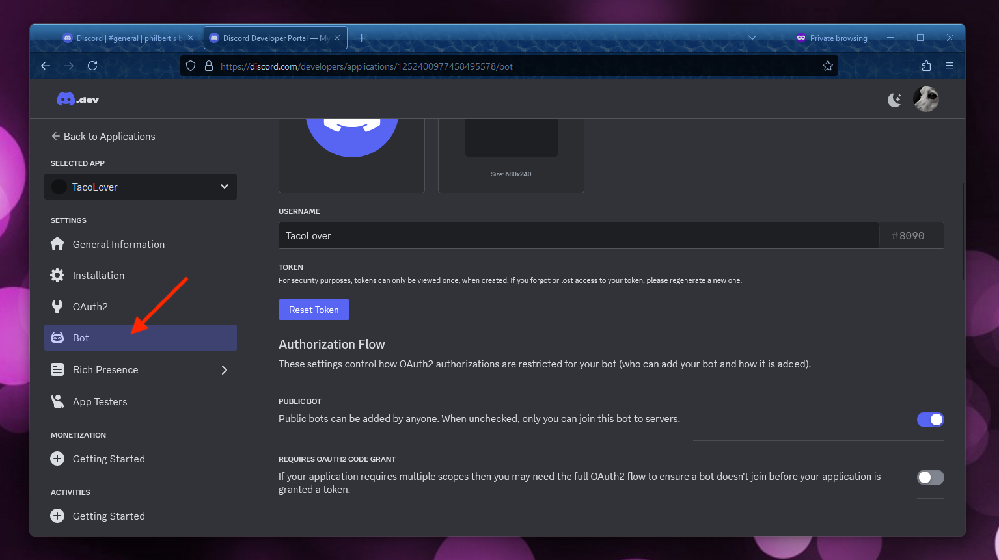

|

Click on the **Reset Token** button. You will be prompted for confirmation as
this would break any apps using a previous token. Given this is a new
app, go ahead and accept. After doing so your application's secret token
will be **only temporarily** displayed! Copy it down now in a secure place.

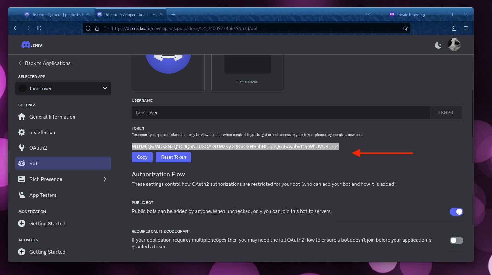

|

Under **Privileged Gateway Intents** you'll need to turn on
``MESSAGE CONTENT INTENT`` to allow your bot to actually see message contents.

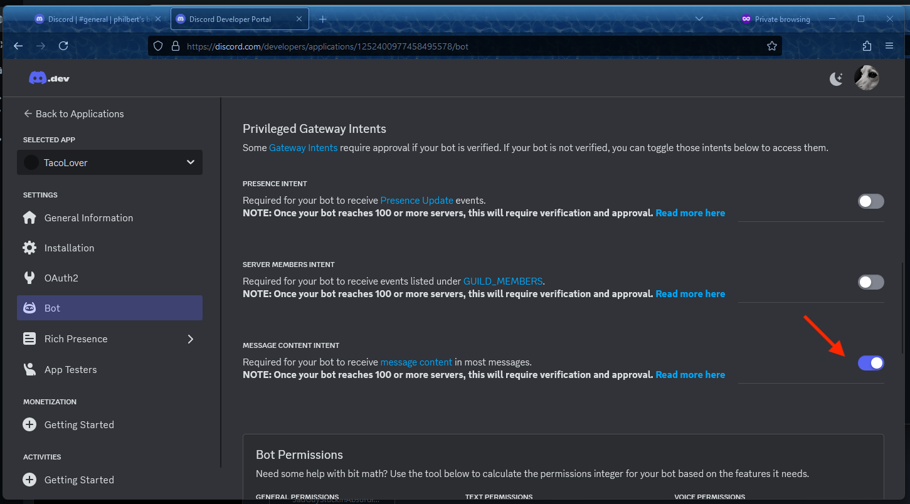

|

Lastly, you'll need to set up permissions and get an installation link.
Navigate to the **Installation** page for your bot.

#. Ensure ``Guild Install`` is checked under **Authorization Methods**.
#. Scroll down to **Default Install Settings** and for ``SCOPES`` you should select ``bot``.
#. For ``PERMISSIONS`` you'll need a minimum of ``Read Message History`` and ``Send Messages``. *(For more complex bots you might need to include more permissions.)*
#. Now, scroll back up to the **Install Link** section and select ``Discord Provided Link``.
#. Copy the generated discord link. It'll start with ``https://discord.com/oauth2/...``.

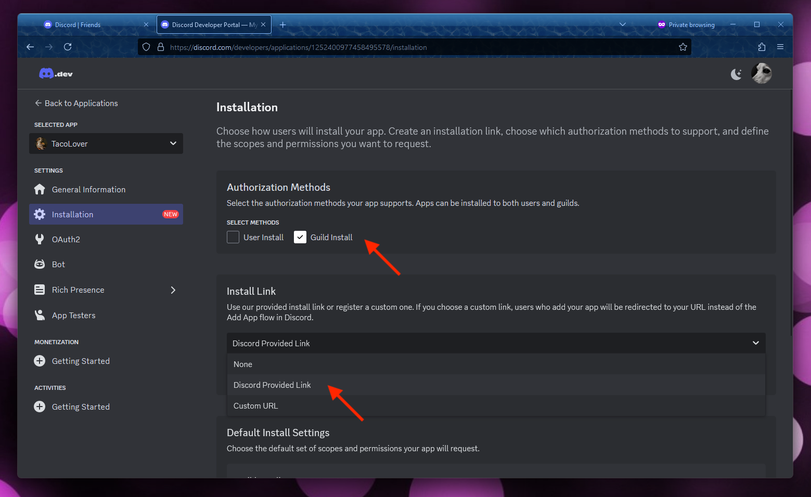

|

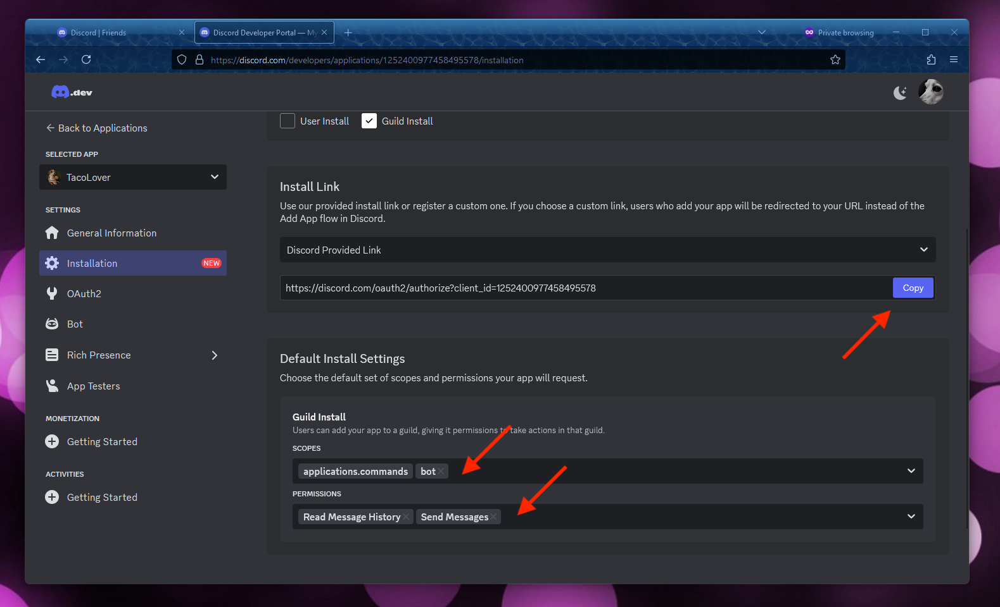

--------------------------------------------------------------------------------

================
Install Docker
================

Install `docker <https://docs.docker.com/get-docker/>`_ the command-line tool
or `docker-desktop <https://www.docker.com/products/docker-desktop/>`_ which
will provide the command-line tools as well as a GUI client.

--------------------------------------------------------------------------------

=================
Download the code
=================

Navigate to `https://github.com/DingoRanchLabs/pBot <https://github.com/DingoRanchLabs/pBot>`_ and
download or clone the project.

--------------------------------------------------------------------------------

=================================
Minimally Configure your bot
=================================

First, rename the file ``config/.env.example`` to just ``config/.env``

Then, update the ``DISCORD_TOKEN`` value from *???* to your secret Discord
token in the new ``config/.env`` file.

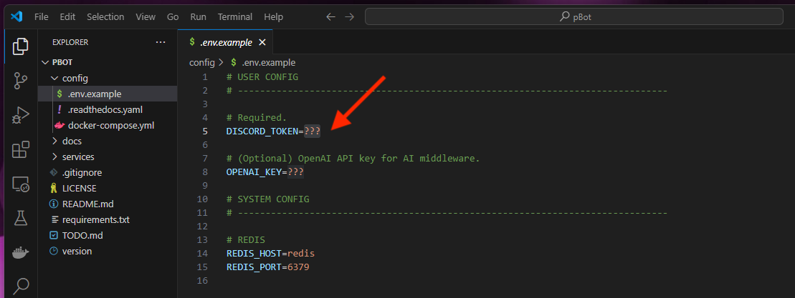

--------------------------------------------------------------------------------

=================================
Run your bot
=================================

From the root directory of pBot, execute the docker-compose command to stand up your
pBot instance: ``docker-compose -pmybot -f./config/docker-compose.yml up --detach``

Assuming no initial errors, you'll need to invite your bot to a server to interact
with it. `Create a new server if you don't already have one <https://support.discord.com/hc/en-us/articles/204849977-How-do-I-create-a-server>`_.
Then, navigate to the install link we generated earlier. *(You can copy it again from the Installation page.)*
You (or any admins you provide the link to) will be prompted to invite the bot
to a server.

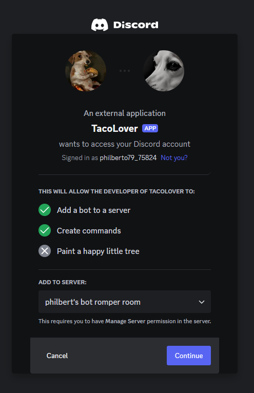

|

What the bot is allowed to do will be displayed before final authorization.

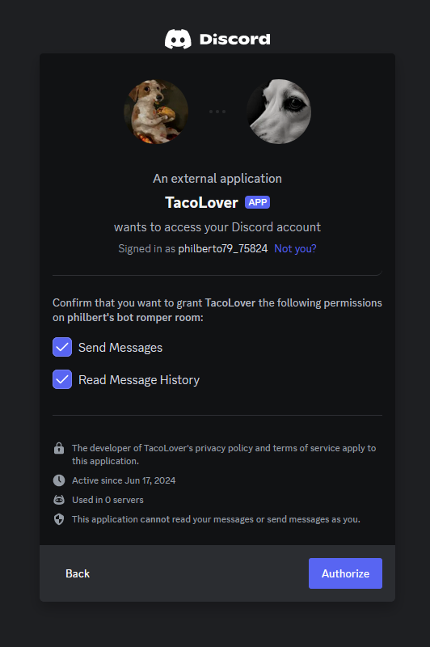

|

You should see a message that your bot has joined the server and the bot status
icon should be green in the **Members List** panel.

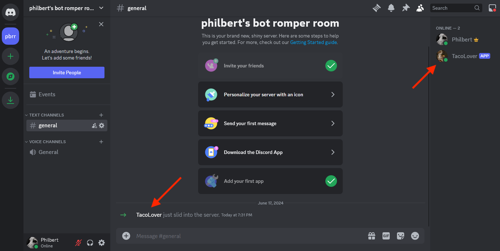

|

However, if you attempt to engage the bot with the magic keyword "taco" we will get no response despite the bot
being shown as logged into the server in the **Members List**.

What gives?

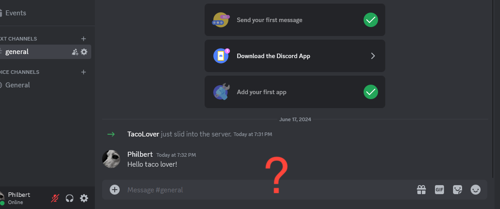

|

By default any channels the bot has access to will **initially be set to not
send responses**. This is because granting the bot access to a server allows it to
interact with all text-based channel in that server.

A simple administration UI is coming to make toggeling these sorts of settings
easy but for now, we must either manually enable each channel or change the
default behaviour of the bot.

In this guide we will simply enable the single channel we care about.

Packaged with pBot is the tool Redis Insight. You can navigate to `localhost:5540 <http://localhost:5540/>`_ and
poke around the database.

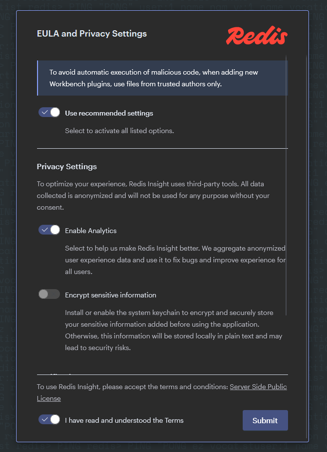

|

To connect Redis Insight to the bot's database:

* Enter ``redis`` for **Host**
* Enter ``6379`` for **Port**
* Enter anything you want for **Datebase Alias**

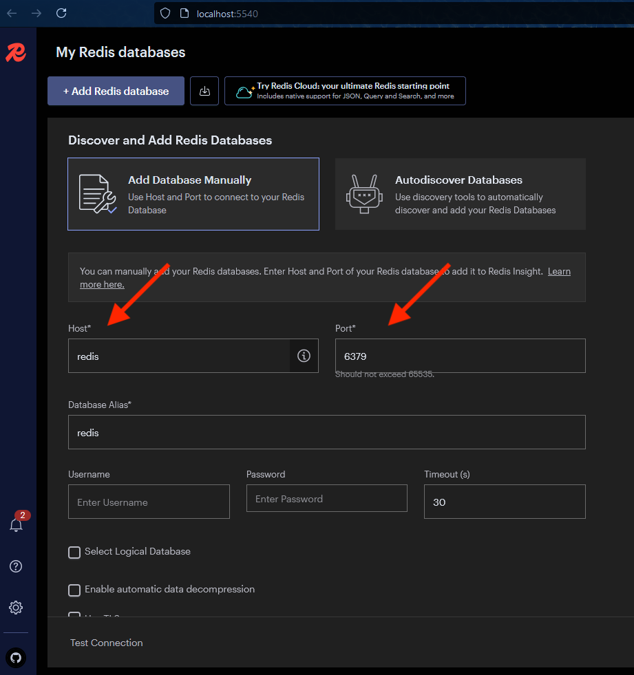

|

Now connected to Redis, you can filter through all the channels that the bot has already seen messages
originate from. In this case the server we invited the bot to only has a single
channel, **general**.

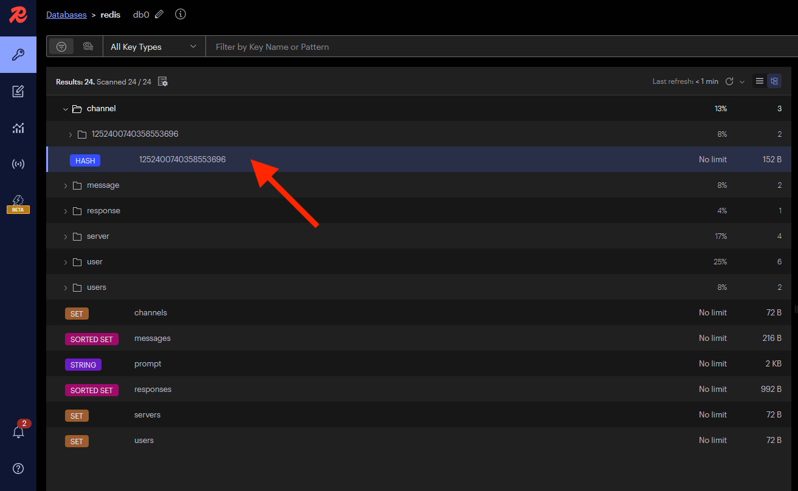

|

Upon changing the channel's ``respond`` attribute from a ``0`` to a ``1``, you
should see a response from the bot pop up.

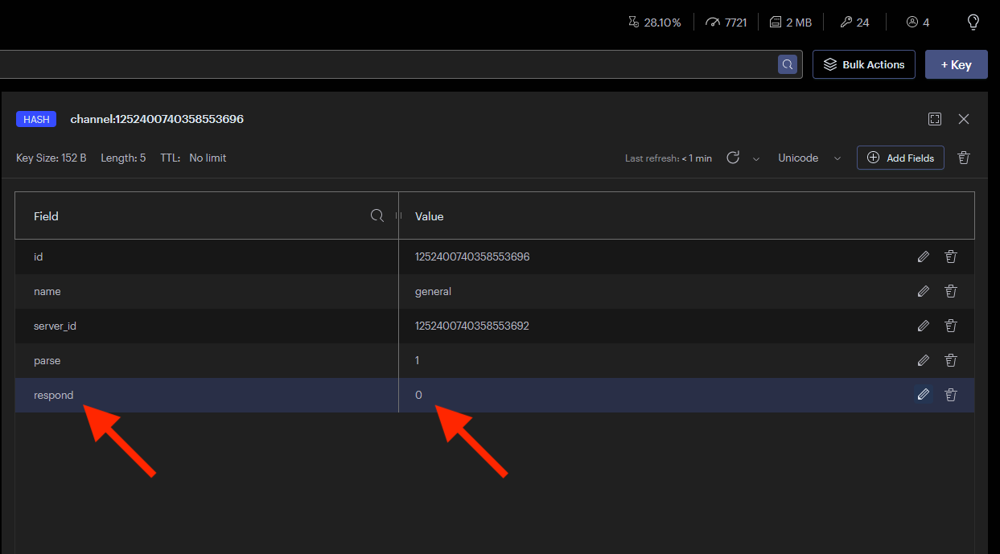

|

Success, the bot lives!

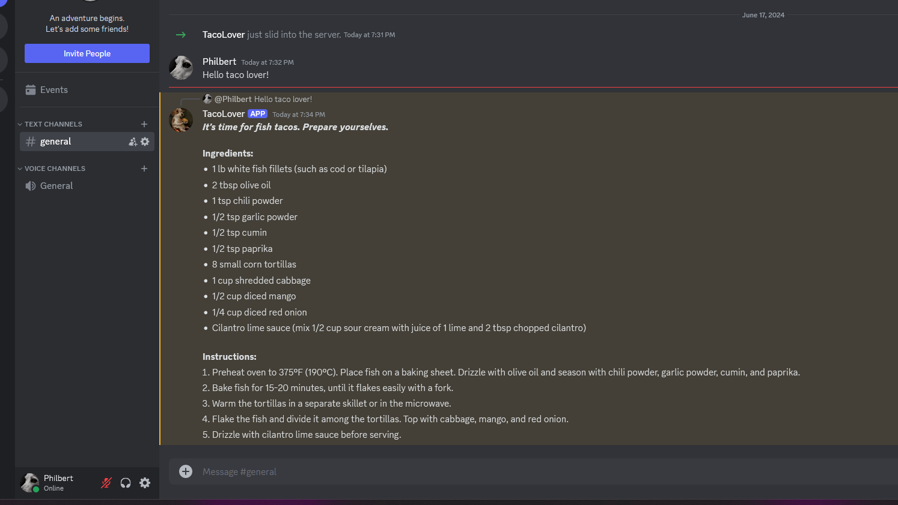

--------------------------------------------------------------------------------

=================================
Where to go from here?
=================================

Now that you've wired everything together, the next step is writing or modifying
middleware to make the bot do what you want.

* Check out the `project overview <overview.html>`_.
* Check out the `Writing Middleware <custom_middleware.html>`_ guide.
* Check out the `API documentation <api.html>`_.

Have fun. Build stuff.
