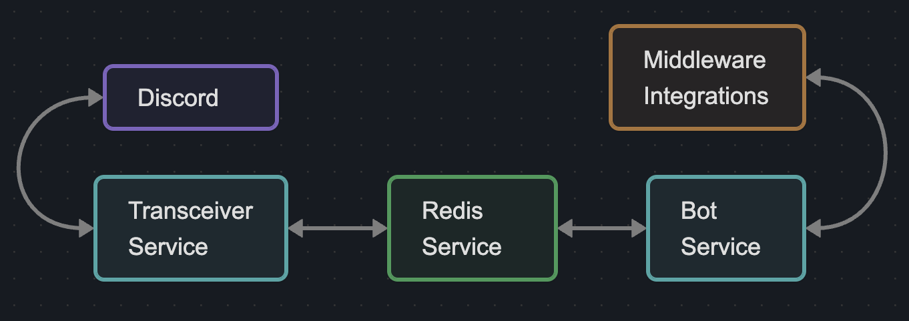
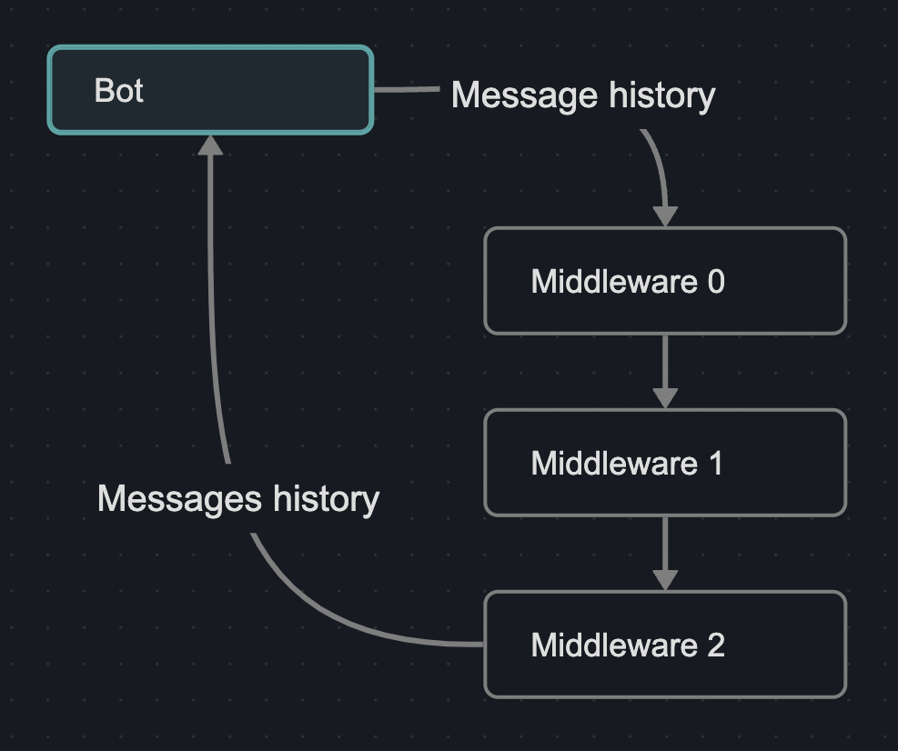

PBot Overview
#############

This document will provide a high level overview of PBot.
The project is lightweight and fairly simple but good documentation is the first barrier to entry
for any open source project adoption.

--------------------------------------------------------------------------------

|

========
Services
========

PBot is a dockerized application with multiple running services.
Beyond those related to Redis, there are two main services that make up PBot:

- Transceiver Service
- Bot Service
- *(Admin Frontend Service OTW)*

See the project-wide `docker-compose.yml <docker_compose.html>`_ file.

|

Transceiver Service
-------------------

A lighweight service meant to transmit responses to and receive messages from Discord.
This service is event driven and based on `Discord.py <https://discordpy.readthedocs.io/en/stable/>`_ which in turn is based on
`asyncio <https://docs.python.org/3/library/asyncio.html>`_.

Unless you want to modify the `models <models.html>`_ stored in Redis, you likely wont need to
delve into the transceiver service.

See `Transceiver Service <transceiver_service.html>`_ for details.

|

Bot Service
-----------

The bot proper.

The bot service constantly looks for channels with recent message activity.
If new unread messages are found and the channel is enabled the recent message history
for that channel is passed through each middleware layer, before final clean up
tasks are run like marking the messages as read.

The most likely starting point for any development is the `middleware <api_bot.middleware.html>`_ run by the bot service.

See `Bot Service <api_service_bot.html>`_ for details.

--------------------------------------------------------------------------------

|

==================
Chatbot Middleware
==================

*This is where all the heavy lifting is done. The rest of of this project is
just meant to make this part easy and fun!* |happy|

Middleware can be thought of as a stack of layers that our message history
will be passed through. Any given layer may manipulate the message history and/or
otherwise act on it.

Each layer on the stack is just a class that inherits from the class
`pbot.middleware.base.Middleware <api_bot.middleware.html#the-middleware-base-class>`_.
Creating your own middleware layer only requires that you implement a single
method, `handle_messages <api_bot.middleware.html#pbot.middleware.base.Middleware.handle_messages>`_. This method must accept a list of messages and return
a list. What your middleware otherwise does, is entirely up to you.

.. note::
   The order middleware is loaded matters.

.. warning::
   When authoring middleware and mutating the message history, consider clean up like marking removed messages as read.

|

Included Middleware
-------------------
These optional middleware either serve as example or facilitate basic utility functions.

- `Reload Prompt <api_bot.middleware.html#reload-prompt-middleware>`_
- `Trim Messages by Tokens <api_bot.middleware.html#trim-messages-by-tokens-middleware>`_
- `Simple OpenAI Middleware <api_bot.middleware.html#simple-openai-middleware>`_

--------------------------------------------------------------------------------

|

=================
Project Structure
=================

Outlined below are the key files and folders of the project.

- **pbot/** |leftarrow| *Project root.*
   - **config/** |leftarrow| *Project-wide configurations.*
      - **.env** |leftarrow| *Shared environment variables & secrets.*
      - **docker-compose.yml**
   - **docs/**
   - **services/** |leftarrow| *Service containers.*
      - **bot/**
         - **src/**
            - **pbot/**
               - [*service source code*]
            - **app.py**
            - **requirements.txt**
         - **Dockerfile**
      - **transceiver/**
         - **src/**
            - **transceiver/**
               - [*service source code*]
            - **app.py**
            - **requirements.txt**
         - **Dockerfile**
   - **requirements.txt**
   - **tasks.py** |leftarrow| *Local development tasks.*

=================
Project To Do
=================

``TODO.md``

.. include:: ../../TODO.md
   :literal:

.. |happy|   unicode:: U+263A .. HAPPYFACE
.. |leftarrow|   unicode:: U+2190 .. LEFTARROW
